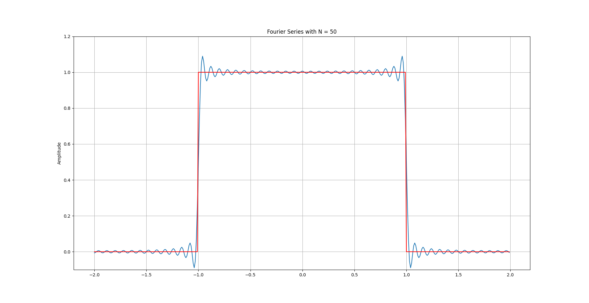

One of the most interesting concepts in the Signal and System course is Fourier Series. The main purpose of the Fourier series is to illustrate a periodic function by summation of the base sinoside function. Consequently, if we have the impulse response of the base function, we can have the response of the base periodic function to the input. For more information regarding the Fourier series and its properties, I suggest you read **Signal and Systems** [book](https://www.amazon.com/Signals-Systems-2nd-Alan-Oppenheim/dp/0138147574) by Oppenheim.
I coded the reconstruction of the periodic square function (with period T = 4).
In the following figure, the Fourier sire of the square function is sketched with N=50. As you see at the discrete points (t=-1 and t=1), there exist ripples and the value of the summation at the discrete points is the average of the left and right of the point ((1+0)/2 = 0.5).

